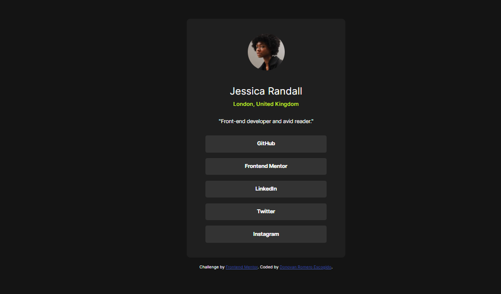

# Frontend Mentor - Social links profile solution

This is a solution to the [Social links profile challenge on Frontend Mentor](https://www.frontendmentor.io/challenges/social-links-profile-UG32l9m6dQ). Frontend Mentor challenges help you improve your coding skills by building realistic projects. 

## Table of contents

  - [The challenge](#the-challenge)
  - [Screenshot](#screenshot)
  - [Links](#links)
- [My process](#my-process)
  - [Built with](#built-with)
  - [What I learned](#what-i-learned)
- [Author](#author)

### The challenge

Users should be able to:

- See hover and focus states for all interactive elements on the page

### Screenshot

### Links

- Solution URL: [Add solution URL here](https://nsvonod12.github.io/Social-links-profile/)

## My process
With practice, everything is easier. In this challenge, I felt incredible!

### Built with

- Semantic HTML5 markup
- CSS custom properties
- Flexbox
- CSS Grid

### What I learned
Once again, I can practice my skills with CSS and HTML5.

## Author

- Website - [Donovan Romero Escogido](https://github.com/nsvonod12)
- Frontend Mentor - [@@nsvonod12](https://www.frontendmentor.io/profile/nsvonod12)
